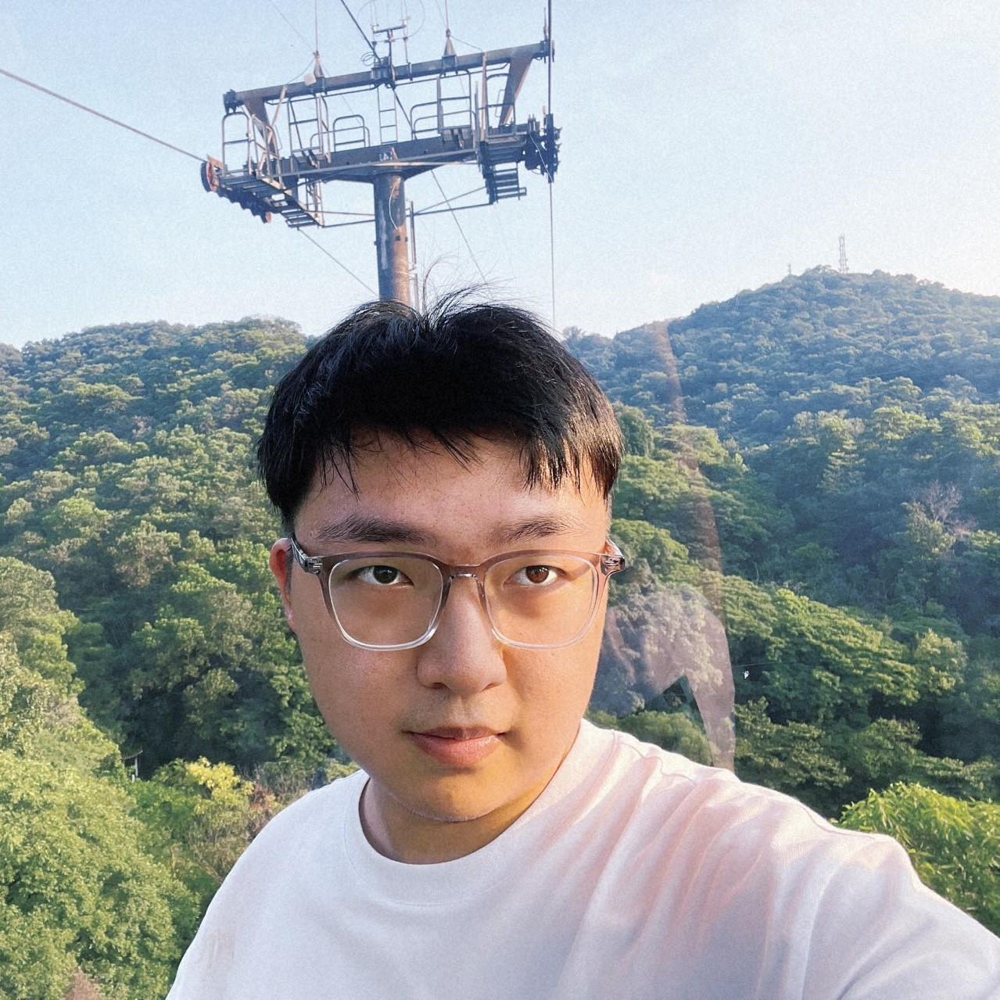

## About Me

I am a PhD student in Biomedical Engineering at [Shanghai Jiao Tong University](https://www.sjtu.edu.cn/), advised by [Prof. Guangzhong Yang](https://bme.sjtu.edu.cn/Web/FacultyDetail/636) in the [Institute of Medical Robotics](https://imr.sjtu.edu.cn/). Before joining IMR, I obtained a bachelor’s degree from the Biomedicine Science of [Zhiyuan Honors Program](https://zhiyuan.sjtu.edu.cn/html/zhiyuan/index.php), Shanghai Jiao Tong University. 

## Research Interest
> Micro/Nano robotics, Brain drug delivery, Microfluidics

## Research Experiences

Lab | Mentor | Time | Research topic
-----|-------|-------- |--------
State Key Laboratory of Microbial Metabolism, SJTU | Undergraduate Researcher, advised by Prof. [Wei Ma](http://mml.sjtu.edu.cn/Data/View/312?showtype=view) | July 2019 - September 2020 | Rapid Detection of Pathogenic Bacteria Based on Whole Genome Sequence
Pediatric Translational Medicine Institute, Shanghai Children's Medical Center, SJTU-SM | Undergraduate Researcher, advised by Prof. [Binbing Zhou](http://daoshi.shsmu.edu.cn/Pages/TeacherInformationView.aspx?uid=9DFC6A44-1940-49E4-8769-C4CBB1B4A10E&from=s&pId=&tId=731) | September 2020 - June 2022 | Chemotherapy drug resistance in MMR‑deficient B cell‑acute lymphoblastic leukemia
Institute of Medical Robotics, SJTU | PhD, advised by Prof. [Guangzhong Yang](https://bme.sjtu.edu.cn/Web/FacultyDetail/636) | September 2022 - | Micro/Nano robotics, Brain drug delivery, Microfluidics

## Publications
1. **Mingzhen Tian**, Zhuo-Chen Ma, Qingqing Han, Qian Suo, Zhijun Zhang and Bing Han (2022). Emerging applications of femtosecond laser fabrication in neurobiological research. _Frontiers in Chemistry_. 10:1051061. [doi: 10.3389/fchem.2022.1051061](https://www.frontiersin.org/articles/10.3389/fchem.2022.1051061)
2. **Mingzhen Tian**, Zhichao Ma, Guang-Zhong Yang (2023). Micro/nano systems for controllable drug delivery to the brain. _Submitted to The Innovation_.

## Honors and Awards

**Scholarships**

Year | Scholarships | Issued by
-----|-------|--------
2018 | Zhiyuan Honorary Scholarship  | Shanghai Jiao Tong University Zhiyuan college
2019 | Zhiyuan Honorary Scholarship  | Shanghai Jiao Tong University Zhiyuan college
2019 | Outstanding Undergraduate Scholarship of Shanghai Jiao Tong University (B) | Shanghai Jiao Tong University
2019 | Sunshine Leader Scholarship of Zhiyuan College (second prize) | Shanghai Jiao Tong University Zhiyuan college
